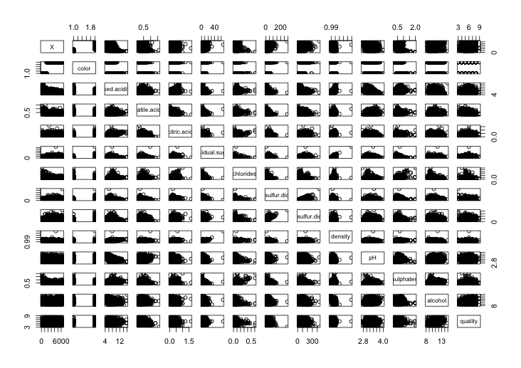
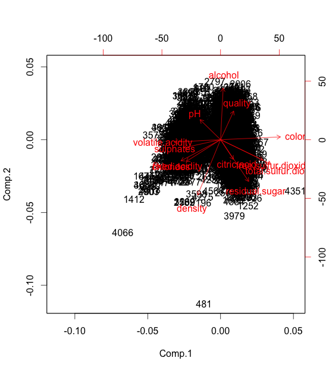

\section{Data Pre-processing}

```{r message=FALSE, echo=FALSE}
library(MASS)
library(genridge)
library(mcmc)
library(glmnet)
library(boot)
library(leaps)
set.seed(23)
```

In this problem, we are given a dataset of Portuguese wines with containing wine properties (e.g."color", "citric.acid", "pH") and their "qualitiy", an integer evaluated by wine experts.
We aim to predict "quality" of Portuguese wines based on the provided properties of each wine.
We decide to formulate this prediction process as a supervised learning problem.
In particular, we use the provided training data to find the relavant properties of wines and their correlations with the wine "quality".
From the according correlations, we build a supervised learning model to predict "quality" based on unseen values of the predictors.

To achieve this, here is an outline the different methods we are going implement

\begin{itemize}
\item Linear regression (with regularization). We will build a linear model based on original features and try to predict wine "quality" based on the model. To find an optimal linear model, we also penalize the regression coefficients with regularization. Cross-validation will be used to evaluate the linear models.
\item Subset selection. We will find the dependence of prediction error rate on feature selection by subset selection. Forward stepping method and exhaustive search methods will be used.
\item Principle component analysis. Original data will be transformed into principle components. A visualization of the principle components will help find the correlation between different features and wine "quality". The principle components will also be used to build regression models.
\item Basis expansion. Interactions and transformations of original feature sets will be considered for potential improvements of the models in predicting wine "quality".
\end{itemize}

We start with first loading the trainig and test data

```{r}
setwd('~shifan/Dropbox/STANFORD/15Winter/STATS315a/hw3/wine')

# Load training and test samples
train <- read.csv("wine.train.csv", header=TRUE)
test <- read.csv("wine.test.ho.csv", header=TRUE)
```

We first visualize the correlations of each pair of properties and "quality" by generating a scatter plot of each possible pair.



```{r, echo=FALSE}
# pairs(train)
```

As we can see, since the first feature (labeled "X") is clearly only a label in the order of wine color (see the correlat), we can omit the first feature. Moreover, within the predictors we have both categorical feature (color) and numerical features. Therefore we first encode the categorical data (only two categories). 

```{r}
# Encode categorial data
train <- train[,2:ncol(train)]
test <- test[,2:ncol(test)]

train[,1] <- model.matrix(~train[,1])[,2]
test[,1] <- model.matrix(~test[,1])[,2]
p = ncol(train) - 1; # Number of features
```

\section{Linear regressions (and with regularization)}

We first implement ordinary linear regression without regularization. In particular, $k$-fold cross validation is used to evaluate the error rate of the regression model.

```{r}
# Linear regression
model <- glm(quality~., data=train)
cv.err <- cv.glm(train, model, K = 10)$delta
```

```{r, echo=FALSE}
cat('Cross Validation Error using Linear regression =',cv.err)
```

Make prediction with linear regression and write to file

```{r}
pred_lm <- predict(model,test)
write(pred_lm,file="lm.txt",sep="\n")
```

Next we implement ridge regression. We plot the change of regression coefficients versus effective degree of freedom.

```{r}
# Ridge regression
lambda <- 10^seq(-5,5,0.1)
model <- ridge(train$quality~., train[,1:p], lambda = lambda)
traceplot(model,X="df")
```

To further investigate the role of regularization, we evaluate the mean-squared error (MSE) of regularized regression using L1 (lasso)

```{r}
lm.ridge <- glmnet(model.matrix(~ ., train[,1:p]),train[,p+1], lambda=lambda, alpha=0)
cv.ridge.err=cv.glmnet(model.matrix(~ ., train[,1:p]),train[,p+1], lambda=lambda, alpha=0)
plot(cv.ridge.err)
```

and L-1 norm penalties (lasso).

```{r}
lm.lasso <- glmnet(model.matrix(~ ., train[,1:p]),train[,p+1], alpha=1)
cv.lasso.err <- cv.glmnet(model.matrix(~ ., train[,1:p]),train[,p+1], alpha=1)
plot(cv.lasso.err)
```

As shown from the above comparisons, Lasso provides an regularized regression model which yields lower MSE with modest choice of regularization parameter $\lambda$ around $10^{-7.5}$ and MSE $\approx 0.27$. With this choice of degree of regularization, we choose to perform lasso and write to the results

```{r}
lasso.opt <- glmnet(model.matrix(~ ., train[,1:p]),train[,p+1], lambda=10^(-5),alpha=1)
pred_lasso <- predict(lasso.opt,newx=model.matrix(~.,test))
write(pred_lasso,file="lasso.txt",sep="\n")
```

\section{Subset selection}

In order to examine the dependence of MSE on subset size (of features), we use subset selection to find how MSE varies with diffferent selection of feature subsets. In particular, we start with linear regression model without regularization.

```{r}
method='exhaustive'
subset.error <- array(0,c(1,p))
for (subset.size in 1:p){
  subset.choose <- summary(regsubsets(quality~., data=train,nvmax=subset.size,method=method))
  subset.best <- subset.choose$which[subset.size,2:p+1]
  subset = train[,c(which(as.numeric(subset.best)==1),p+1)]
  
  lm <- glm(quality~., data=subset)
  cv.err <- cv.glm(subset, lm, K = 10)$delta
  subset.error[subset.size] <- cv.err[2]
}
plot(1:p,subset.error,type="o",xlab="Subset Size", ylab="CV Error")
```

As shown in the previous figure, cross-validation (CV) error of subset selection mostly monotonically decreases (except a local minimum at subset size 7 features) with subset size. CV error achieves minimum when all features are used. We attribute this to the limited size of feature space and large dataset. Therefore we conclude that all features will need to be used for predictions.

\section{Principle Components Analysis}

Next to elucidate the role of each feature in predicting the wine "quality", we perform principle component analysis to look at the correlations of each feature and "quality".

```{r}
pca <- princomp(train, cor=TRUE)
summary(pca) # print variance accounted for 
```

```{r, echo=FALSE}
plot(pca,type="line")
```



We fist note that the first two principle components are most dominant after transformation. Therefore it is reasonable to look at the first two comonents of the features and responses.

```{r, echo=FALSE}
# biplot(fit)
```

Similar to what we found in ridge regression, the feature "alcohol" is positively correlated with "quality" Additionally, the features "density" and "volatile.acidity" are negatively correlated with "quality".

\section{Basis expansion}